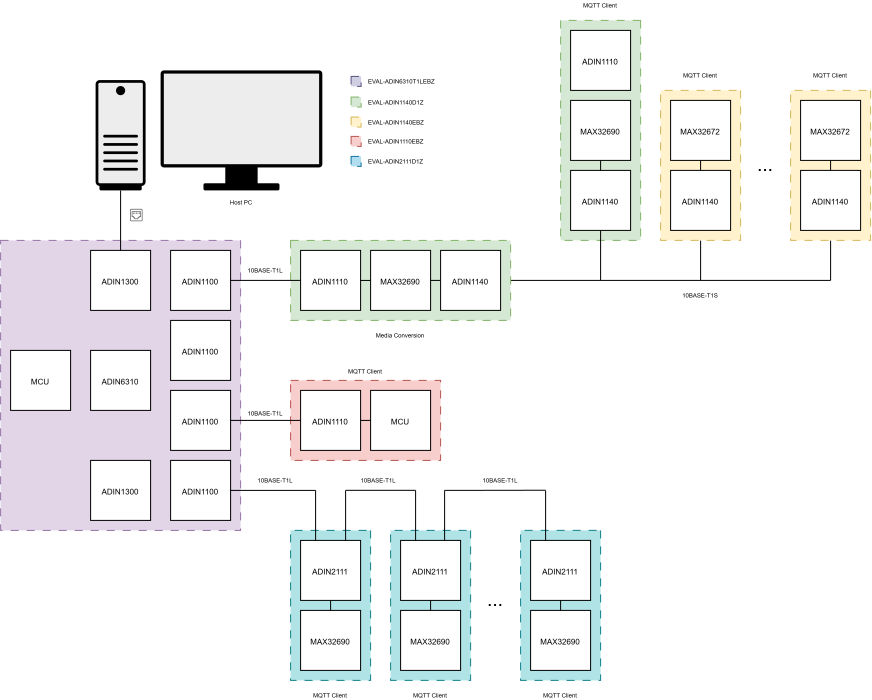
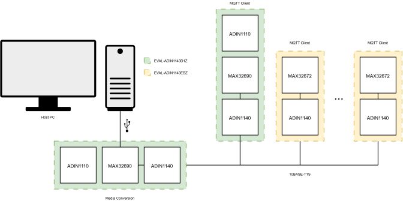
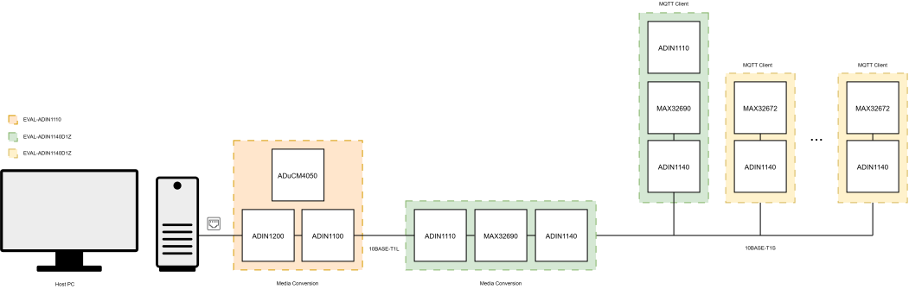
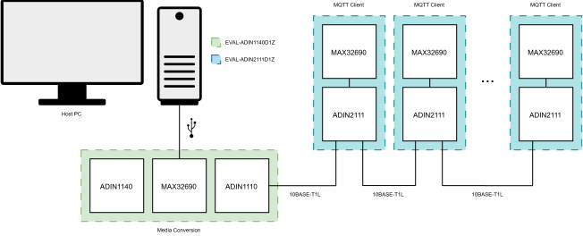
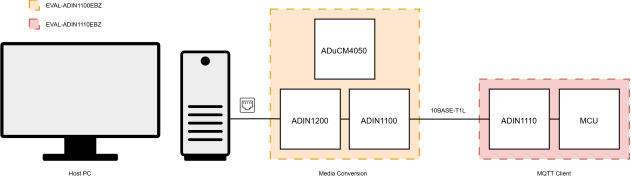

.. _topologies:

####################
 Network Topologies
####################

SPE Hub supports a range of network topologies. The configurations presented in
this section serve as reference examples for establishing communication between
network nodes and the SPE Hub. The sample topologies are not exhaustive but
represent common evaluation setups. The evaluation kits currently supported:

- :adi:`EVAL-ADIN1140D1Z`
- :adi:`EVAL-ADIN1100EBZ`

*******************
 Sample Topology 1
*******************

The SPE Hub application runs on a host PC and connects to the network through the
EVAL-ADIN6310T1LEBZ. The EVAL-ADIN6310T1LEBZ is built around the ADIN6310 switch
and integrates four ADIN1100 10BASE-T1L Ethernet PHYs, two ADIN1300 Gigabit
Ethernet PHYs, and a MAX32690 microcontroller for switch management and
configuration.

-  The EVAL-ADIN1140D1Z is connected to an ADIN1100 port on the
   EVAL-ADIN6310T1LEBZ and performs 10BASE-T1L to 10BASE-T1S media conversion.
   This creates a 10BASE-T1S multidrop network, enabling multiple nodes to
   operate as MQTT clients and communicate over a shared bus.

-  The EVAL-ADIN1110EBZ is connected to an ADIN1100 port on the
   EVAL-ADIN6310T1LEBZ. The EVAL-ADIN1110EBZ functions as an MQTT client within
   the network.

-  The EVAL-ADIN2111D1Z is connected to an ADIN1100 port on the
   EVAL-ADIN6310T1LEBZ. The EVAL-ADIN2111D1Z forms a 10BASE-T1L daisy-chained
   network topology with each node functioning as an MQTT client.

   *Sample Topology 1*

**Products:**

-  :adi:`ADIN6310`
-  :adi:`ADIN1140`
-  :adi:`ADIN2111`
-  :adi:`ADIN1110`

**Evaluation Boards:**

-  :adi:`EVAL-ADIN6310T1LEBZ`
-  :adi:`EVAL-ADIN1140D1Z`
-  :adi:`DEMO-ADIN114XAZ`
-  :adi:`EVAL-ADIN2111D1Z`
-  :adi:`EVAL-ADIN1110`

*******************
 Sample Topology 2
*******************

The SPE Hub application runs on a host PC and connects to the network through
the EVAL-ADIN1140D1Z, which functions as a USB-to-10BASE-T1S media converter via
its onboard microcontroller. This creates a 10BASE-T1S multidrop network, where
the connected nodes operate as MQTT clients.

   *Sample Topology 2*

**Products:**

-  :adi:`ADIN1140`

**Evaluation Boards:**

-  :adi:`EVAL-ADIN1140D1Z`
-  :adi:`EVAL-ADIN1140EBZ`

*******************
 Sample Topology 3
*******************

The SPE Hub application runs on a host PC and connects to the network through
the EVAL-ADIN1100EBZ, which functions as a 10BASE-T to 10BASE-T1L media
converter. The EVAL-ADIN1140D1Z performs 10BASE-T1L to 10BASE-T1S media
conversion via its onboard microcontroller, forming a 10BASE-T1S multidrop
network. The nodes on this multidrop segment operate as MQTT clients, enabling
communication over the shared bus.

   *Sample Topology 3*

**Products:**

-  :adi:`ADIN1140`
-  :adi:`ADIN1100`
-  :adi:`ADIN1200`

**Evaluation Boards:**

-  :adi:`EVAL-ADIN1100`
-  :adi:`EVAL-ADIN1140D1Z`

*******************
 Sample Topology 4
*******************

The SPE Hub application runs on a host PC and connects to the network through
the EVAL-ADIN1140D1Z, which functions as a USB-to-10BASE-T1S media converter via
its onboard microcontroller. The EVAL-ADIN2111D1Z forms a 10BASE-T1L daisy-chained
network topology with each node functioning as an MQTT client.

   *Sample Topology 4*

**Products:**

-  :adi:`ADIN1140`
-  :adi:`ADIN2111`

**Evaluation Boards:**

-  :adi:`EVAL-ADIN1140D1Z`
-  :adi:`EVAL-ADIN2111D1Z`

*******************
 Sample Topology 5
*******************

The SPE Hub application runs on a host PC and connects to the network through
the EVAL-ADIN1100EBZ, which functions as a 10BASE-T to 10BASE-T1L media
converter. The EVAL-ADIN1110EBZ functions as an MQTT client within the network.

   *Sample Topology 5*

**Products:**

-  :adi:`ADIN1100`
-  :adi:`ADIN1200`
-  :adi:`ADIN1110`

**Evaluation Boards:**

-  :adi:`EVAL-ADIN1100`
-  :adi:`EVAL-ADIN1110`
